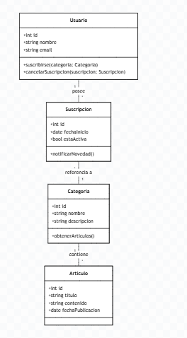

# Parte 2: Diagrama de Clases

Incluye aqui tu diagrama de clases o una descripcion estructurada.

**ID: CU-05**

**Nombre:"Suscripción a Categorías de Artículos" ** 

**Actor Principal: Usuario Registrado**
classDiagram
    class Usuario {
        +int id
        +string nombre
        +string email
        +suscribirse(categoria: Categoria)
        +cancelarSuscripcion(suscripcion: Suscripcion)
    }

    class Suscripcion {
        +int id
        +date fechaInicio
        +bool estaActiva
        +notificarNovedad()
    }

    class Categoria {
        +int id
        +string nombre
        +string descripcion
        +obtenerArticulos()
    }

    class Articulo {
        +int id
        +string titulo
        +string contenido
        +date fechaPublicacion
    }

    Usuario "1" -- "*" Suscripcion : posee
    Suscripcion "*" -- "1" Categoria : referencia a
    Categoria "1" -- "*" Articulo : contiene

    img()
    